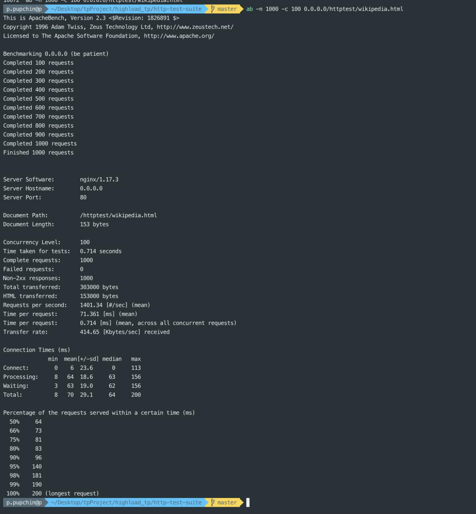

## Launch docker

`docker build -t highload_tp .`
`docker run -it  -p 80:80 -v httpd.conf:/etc/httpd.conf:ro -v /Users/p.pupchin/Desktop/tpProject/highload_tp/http-test-suite:/var/www/html:ro highload_tp:latest`

## Tests

`python2 httptest.py`

## Nginx docker start

`docker run -it -v /Users/p.pupchin/Desktop/tpProject/highload_tp/http-test-suite:/usr/share/nginx/html:ro -p 80:80 -d nginx`

## AB highload

`ab -n 1000 -c 100 0.0.0.0/httptest/wikipedia.html`

## AB nginx

`ab -n 1000 -c 100 0.0.0.0/httptest/wikipedia.html`

